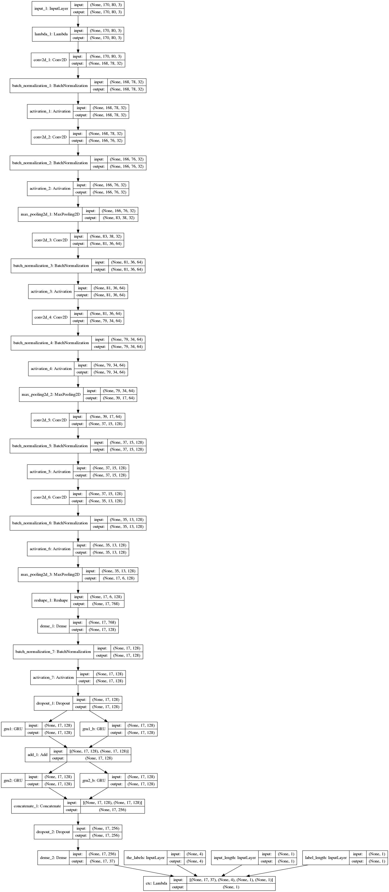
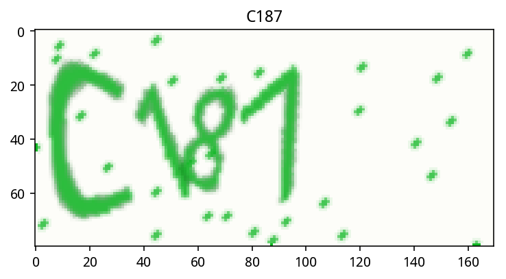
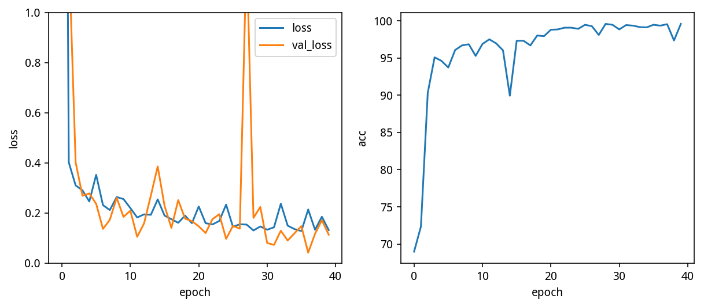
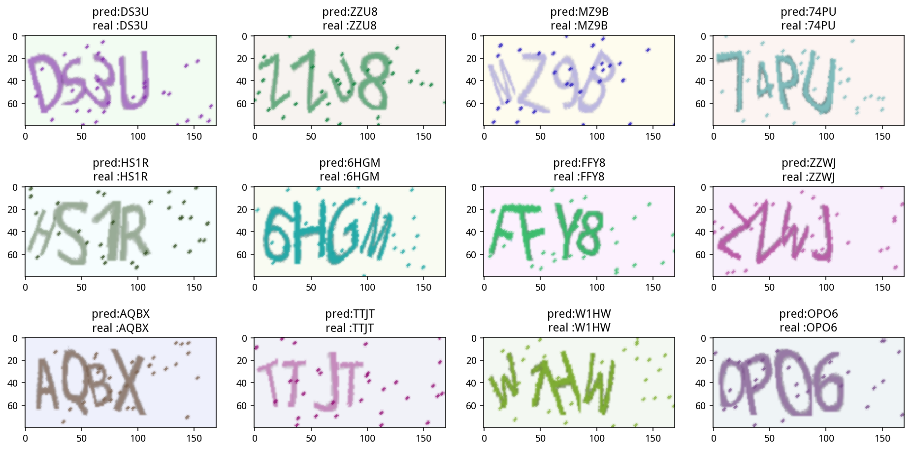
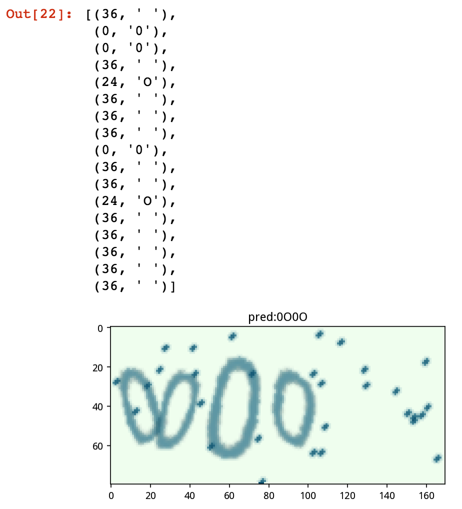

# 使用循环神经网络破解验证码

对于这种按顺序书写的文字，我们可以使用循环神经网络来识别序列。下面我们来了解一下如何使用循环神经网络来识别这类验证码。

captcha 部分的代码和之前卷积神经网络识别的一样，只是将 `n_class` 改为了 `len(characters)+1`，因为我们需要添加一个空白类用于 CTC Loss。

参考链接：[使用深度学习来破解 captcha 验证码](https://zhuanlan.zhihu.com/p/26078299)

```py
from captcha.image import ImageCaptcha
import matplotlib.pyplot as plt
import numpy as np
import random

%matplotlib inline
%config InlineBackend.figure_format = 'retina'

import string
characters = string.digits + string.ascii_uppercase
print(characters)

width, height, n_len, n_class = 170, 80, 4, len(characters)+1

generator = ImageCaptcha(width=width, height=height)
random_str = ''.join([random.choice(characters) for j in range(4)])
img = generator.generate_image(random_str)

plt.imshow(img)
plt.title(random_str)
```

## CTC Loss

这个 loss 是一个特别神奇的 loss，它可以在只知道序列的顺序，不知道具体位置的情况下，让模型收敛。（[warp-ctc](https://github.com/baidu-research/warp-ctc)）


那么在 Keras 里面，CTC Loss 已经内置了，我们直接定义这样一个函数即可，由于我们使用的是循环神经网络，所以默认丢掉前面两个输出，因为它们通常无意义，且会影响模型的输出。

* y\_pred 是模型的输出，是按顺序输出的37个字符的概率，因为我们这里用到了循环神经网络，所以需要一个空白字符的类；
* labels 是验证码，是四个数字，每个数字对应字符的编号；
* input\_length 表示 y\_pred 的长度，我们这里是15；
* label\_length 表示 labels 的长度，我们这里是4。

```py
from keras import backend as K

def ctc_lambda_func(args):
    y_pred, labels, input_length, label_length = args
    y_pred = y_pred[:, 2:, :]
    return K.ctc_batch_cost(labels, y_pred, input_length, label_length)
```

## 模型结构

我们的模型结构是这样设计的，首先通过卷积神经网络去识别特征，然后经过一个全连接降维，再按水平顺序输入到一种特殊的循环神经网络，叫 GRU，全程是 Gated Recurrent Unit，可以理解为是 LSTM 的简化版。LSTM 早在1997年就已经被发明出来了，但是 GRU 直到2014年才出现。经过实验，GRU 效果比 LSTM 要好。

参考链接：https://zhuanlan.zhihu.com/p/28297161

```py
from keras.models import *
from keras.layers import *
from keras.optimizers import *
rnn_size = 128

input_tensor = Input((width, height, 3))
x = input_tensor
x = Lambda(lambda x:(x-127.5)/127.5)(x)
for i in range(3):
    for j in range(2):
        x = Convolution2D(32*2**i, 3, kernel_initializer='he_uniform')(x)
        x = BatchNormalization()(x)
        x = Activation('relu')(x)
    x = MaxPooling2D((2, 2))(x)

conv_shape = x.get_shape().as_list()
rnn_length = conv_shape[1]
rnn_dimen = conv_shape[2]*conv_shape[3]
print(conv_shape, rnn_length, rnn_dimen)
x = Reshape(target_shape=(rnn_length, rnn_dimen))(x)
rnn_length -= 2

x = Dense(rnn_size, kernel_initializer='he_uniform')(x)
x = BatchNormalization()(x)
x = Activation('relu')(x)
x = Dropout(0.2)(x)

gru_1 = GRU(rnn_size, return_sequences=True, kernel_initializer='he_uniform', name='gru1')(x)
gru_1b = GRU(rnn_size, return_sequences=True, kernel_initializer='he_uniform', 
             go_backwards=True, name='gru1_b')(x)
x = add([gru_1, gru_1b])

gru_2 = GRU(rnn_size, return_sequences=True, kernel_initializer='he_uniform', name='gru2')(x)
gru_2b = GRU(rnn_size, return_sequences=True, kernel_initializer='he_uniform', 
             go_backwards=True, name='gru2_b')(x)
x = concatenate([gru_2, gru_2b])

x = Dropout(0.2)(x)
x = Dense(n_class, activation='softmax')(x)
base_model = Model(inputs=input_tensor, outputs=x)

labels = Input(name='the_labels', shape=[n_len], dtype='float32')
input_length = Input(name='input_length', shape=[1], dtype='int64')
label_length = Input(name='label_length', shape=[1], dtype='int64')
loss_out = Lambda(ctc_lambda_func, output_shape=(1,), 
                  name='ctc')([x, labels, input_length, label_length])

model = Model(inputs=[input_tensor, labels, input_length, label_length], outputs=[loss_out])
model.compile(loss={'ctc': lambda y_true, y_pred: y_pred}, optimizer='adam')
```

从 Input 到 最后一个 MaxPooling2D，是一个很深的卷积神经网络，它负责学习字符的各个特征，尽可能区分不同的字符。它输出 shape 是 `[None, 17, 6, 128]`，这个形状相当于把一张宽为 170，高为 80 的彩色图像 (170, 80, 3)，压缩为宽为 17，高为 6 的 128维特征的特征图 (17, 6, 128)。

然后我们把图像 reshape 成 (17, 768)，也就是把高和特征放在一个维度，然后降维成 (17, 128)，也就是从左到右有17条特征，每个特征128个维度。

这128个维度就是这一条图像的非常高维，非常抽象的概括，然后我们将17个特征向量依次输入到 GRU 中，GRU 有能力学会不同特征向量的组合会代表什么字符，即使是字符之间有粘连也不会怕。这里使用了双向 GRU，

最后 Dropout 接一个全连接层，作为分类器输出每个字符的概率。

这个是 base\_model 的结构，也是我们模型的结构。那么后面的 labels, input\_length, label\_length 和 loss_out 都是为了输入必要的数据来计算 CTC Loss 的。


## 模型可视化

可视化的代码同上，这里只贴图。



可以看到模型比上一个模型复杂了许多，但实际上只是因为输入比较多，所以它显得很大。还有一个值得注意的地方，我们的图片在输入的时候是经过了旋转的，这是因为我们希望以水平方向输入循环神经网络，而图片在 numpy 里默认是这样的形状：(height, width, 3)，因此我们使用了 `transpose` 函数将图片转为了(width, height, 3)的格式，这样就能把 X 轴转到第一个维度，方便输入到循环神经网络。

## 数据生成器

根据模型的输入，我们需要输入四个数据：

* X 是一批图片；
* y 是每个图片对应的 label，最大长度为 n_len；
* input\_length 表示模型输出的长度，我们这里是15；
* label\_length 表示 labels 的长度，我们这里是4。

最后还有一个输入是 `np.ones(batch_size)`，这是因为 Keras 在训练模型的时候必须输入一个 X 和一个 y，我们这里把上面四个都合并为一个 X 了，因此实际上 y 没有参与 loss 的计算，所以随便编一个 `batch_size` 长度的数据输入进去就好了。

```py
def gen(batch_size=128):
    X = np.zeros((batch_size, width, height, 3), dtype=np.uint8)
    y = np.zeros((batch_size, n_len), dtype=np.uint8)
    generator = ImageCaptcha(width=width, height=height)
    while True:
        for i in range(batch_size):
            random_str = ''.join([random.choice(characters) for j in range(n_len)])
            X[i] = np.array(generator.generate_image(random_str)).transpose(1, 0, 2)
            y[i] = [characters.find(x) for x in random_str]
        yield [X, y, np.ones(batch_size)*rnn_length, np.ones(batch_size)*n_len], np.ones(batch_size)
```

我们可以举个例子，使用一次生成器，看看输出的是什么内容：

```py
(X_vis, y_vis, input_length_vis, label_length_vis), _ = next(gen(1))
print(X_vis.shape, y_vis, input_length_vis, label_length_vis)

plt.imshow(X_vis[0].transpose(1, 0, 2))
plt.title(''.join([characters[i] for i in y_vis[0]]))
```

我们可以看到输出了下面的内容：

`(1, 170, 80, 3) [[29  4 21 21]] [ 15.] [ 4.]`



这里：

* X 的 shape 是 `(1, 170, 80, 3)`，如果有 n 张图，shape 就是 `(n, 170, 80, 3)`
* y 是 label，我们可以看到生成的图片是 T4LL，那么按上面的 characters，label 就是 `[29 4 21 21]`，外面还有一个框是因为这里面可以有 n 个 label
* input\_length 表示模型输出的长度，我们这里是15；
* label\_length 表示 labels 的长度，我们这里是4。

## 评估模型

我们会通过这个函数来评估我们的模型，和上面的评估标准一样，只有全部正确，我们才算预测正确。这里有个坑，就是模型最开始训练的时候，并不一定会输出四个字符，所以我们如果遇到所有的字符都不到四个的时候，就不用计算了，一定是全错。遇到多于四个字符的时候，只取前四个。

```py
def evaluate(batch_size=128, steps=10):
    batch_acc = 0
    generator = gen(batch_size)
    for i in range(steps):
        [X_test, y_test, _, _], _  = next(generator)
        y_pred = base_model.predict(X_test)
        shape = y_pred[:,2:,:].shape
        ctc_decode = K.ctc_decode(y_pred[:,2:,:], input_length=np.ones(shape[0])*shape[1])[0][0]
        out = K.get_value(ctc_decode)[:, :n_len]
        if out.shape[1] == n_len:
            batch_acc += (y_test == out).all(axis=1).mean()
    return batch_acc / steps
```

## 评估回调

因为 Keras 没有针对 CTC 模型计算准确率的选项，因此我们需要自定义一个回调函数，它会在每一代训练完成的时候计算模型的准确率。

```py
from keras.callbacks import *

class Evaluator(Callback):
    def __init__(self):
        self.accs = []
    
    def on_epoch_end(self, epoch, logs=None):
        acc = evaluate(steps=20)*100
        self.accs.append(acc)
        print('')
        print('acc: %f%%' % acc)

evaluator = Evaluator()
```

## 训练模型

我们先按 `Adam(1e-3)` 的学习率训练20代，让模型快速收敛，然后以 `Adam(1e-4)` 的学习率再训练20代。这里设置每代训练 400 个 step，也就是每代 `400*128=51200` 个样本，验证集设置的是 `20*128=2048` 个样本。

```py
h = model.fit_generator(gen(128), steps_per_epoch=400, epochs=20,
                        callbacks=[evaluator],
                        validation_data=gen(128), validation_steps=20)
```

```py
model.compile(loss={'ctc': lambda y_true, y_pred: y_pred}, optimizer=Adam(1e-4))
h2 = model.fit_generator(gen(128), steps_per_epoch=400, epochs=20, 
                        callbacks=[evaluator],
                        validation_data=gen(128), validation_steps=20)
```

然后我们将 loss 和 acc 的曲线图画出来：

```py
plt.figure(figsize=(10, 4))
plt.subplot(1, 2, 1)
plt.plot(h.history['loss'] + h2.history['loss'])
plt.plot(h.history['val_loss'] + h2.history['val_loss'])
plt.legend(['loss', 'val_loss'])
plt.ylabel('loss')
plt.xlabel('epoch')
plt.ylim(0, 1)

plt.subplot(1, 2, 2)
plt.plot(evaluator.accs)
plt.ylabel('acc')
plt.xlabel('epoch')
```



训练到20代的时候，模型是这样的表现：

```
Epoch 20/20
399/400 [============================>.] - ETA: 0s - loss: 0.1593
acc: 97.929688%
400/400 [==============================] - 122s - loss: 0.1589 - val_loss: 0.1671
```

训练到40代的时候，模型是这样的表现：

```
Epoch 20/20
399/400 [============================>.] - ETA: 0s - loss: 0.1317
acc: 99.570312%
400/400 [==============================] - 123s - loss: 0.1315 - val_loss: 0.1130
```

## 测试模型

```py
(X_vis, y_vis, input_length_vis, label_length_vis), _ = next(gen(12))

y_pred = base_model.predict(X_vis)
shape = y_pred[:,2:,:].shape
ctc_decode = K.ctc_decode(y_pred[:,2:,:], input_length=np.ones(shape[0])*shape[1])[0][0]
out = K.get_value(ctc_decode)[:, :4]

plt.figure(figsize=(16, 8))
for i in range(12):
    plt.subplot(3, 4, i+1)
    plt.imshow(X_vis[i].transpose(1, 0, 2))
    plt.title('pred:%s\nreal :%s' % (''.join([characters[x] for x in out[i]]), 
                                     ''.join([characters[x] for x in y_vis[i]])))
```



## 评估模型

我们可以尝试计算模型的总体准确率，以及看看模型到底错在哪。首先生成1024个样本，然后用 `base_model` 进行预测，然后裁剪并进行 ctc 解码，最后裁剪到4个 label 并与真实值进行对比。

```py
(X_vis, y_vis, input_length_vis, label_length_vis), _ = next(gen(10000))

y_pred = base_model.predict(X_vis, verbose=1)
shape = y_pred[:,2:,:].shape
ctc_decode = K.ctc_decode(y_pred[:,2:,:], input_length=np.ones(shape[0])*shape[1])[0][0]
out = K.get_value(ctc_decode)[:, :4]

(y_vis == out).all(axis=1).mean()

# 0.99460000000000004
```

输出结果是99.46%的准确率，已经比上一个模型强很多了。

我们可以对预测错的样本进行统计：

```py
from collections import Counter
Counter(''.join([characters[i] for i in y_vis[y_vis != out]]))

Counter({'0': 37, 'O': 14, 'Q': 1, 'T': 1, 'W': 1})
```

我们可以发现模型在 0 和 O 的准确率稍微低一点，其他的错误都只是个例。0与 O 确实是很难分辨的，我们可以尝试用代码生成一个 '0O0O' 的图像，然后用模型预测：

```py
characters2 = characters + ' '

generator = ImageCaptcha(width=width, height=height)
random_str = '0O0O'
X_test = np.array(generator.generate_image(random_str))
X_test = X_test.transpose(1, 0, 2)
X_test = np.expand_dims(X_test, 0)

y_pred = base_model.predict(X_test)
shape = y_pred[:,2:,:].shape
ctc_decode = K.ctc_decode(y_pred[:,2:,:], input_length=np.ones(shape[0])*shape[1])[0][0]
out = K.get_value(ctc_decode)[:, :4]
out = ''.join([characters[x] for x in out[0]])

plt.imshow(X_test[0].transpose(1, 0, 2))
plt.title('pred:' + str(out))

argmax = np.argmax(y_pred, axis=2)[0]
list(zip(argmax, ''.join([characters2[x] for x in argmax])))
```



可以看到模型预测得还是很准的。

## 总结

模型的大小是3.3MB，在显卡上跑10000张验证码需要用9秒，平均一秒识别一千张以上，完全可以拼过网速。即使是在笔记本上跑，也可以跑到一秒几十张的速度，因此此类验证码可以说已经被破解了。
